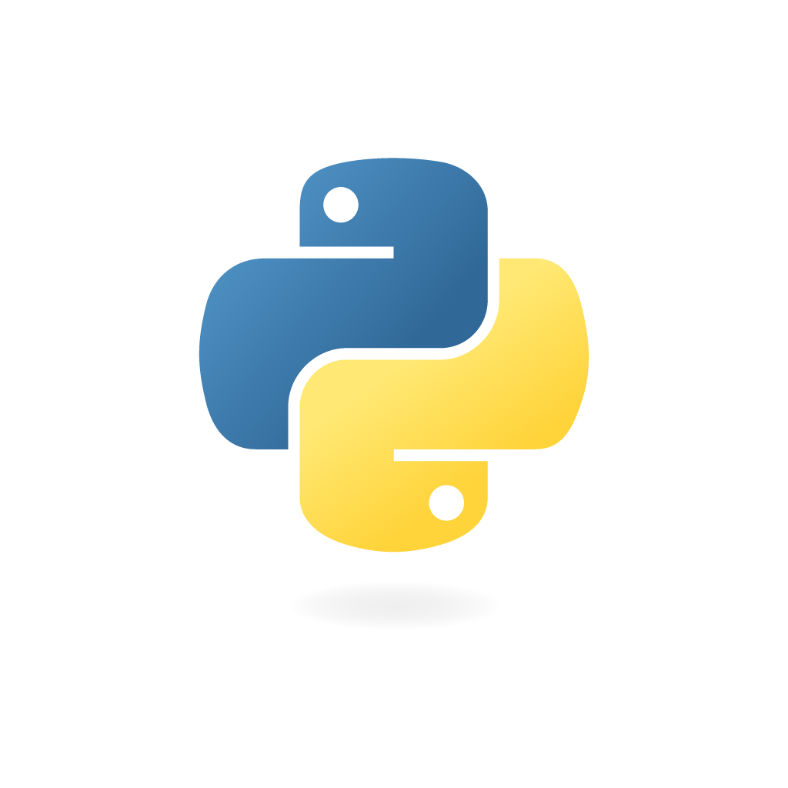
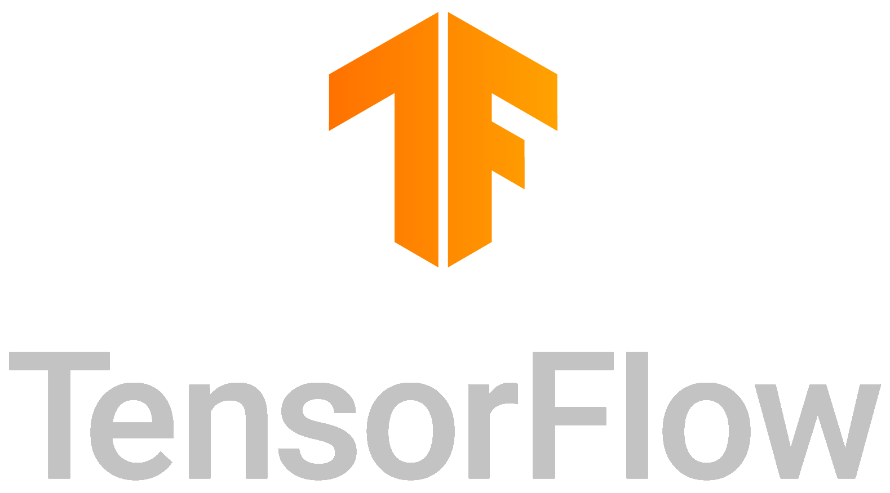
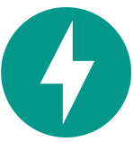
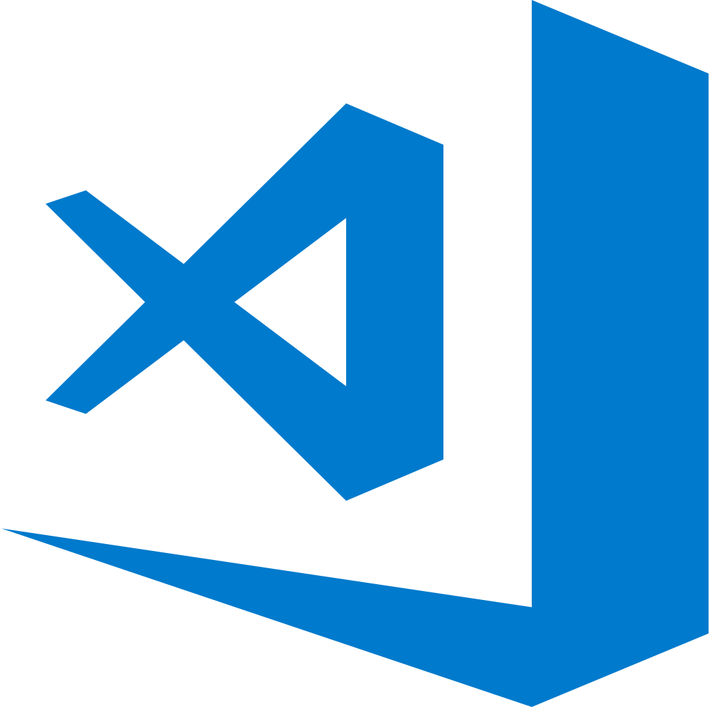

<!-- Social icons section -->
<h1 align="center"> Social Media: </h1>
  

    <!--  -->
    
    
    
  

</h1>

<!-- Description about me -->
<h2 align="center"> 🤔 About me 👨‍💻 </h2>

I am Lê Thành Nghĩa better known as <b>Bagumeow</b>🕵🏼‍♂️  
I am a Senior student with a strong passion for artificial intelligence, especially generative AI. I hope to contribute to the AI community as a whole, as well.

If you want to know more about me, you can visit my [LinkedIn](https://www.linkedin.com/in/bagumeow/) profile or my CV [here](./CV/CV_LeThanhNghia_4_2024.pdf).
   

<!-- Bogota's weather table -->

### 🧐 More About Me:
<table style="border: none;">
  <tr style="border: none;">
    <td style="border: none;">
      <ul>
        <li>
          🔭 I’m currently studying at <b>IUH</b>
        </li>
        <li>
          🌱 I’m currently working at NinjaVan Vietnam as a Data Scientist intern
        <li>
           👨‍🔬I have a great passion for Linear Algebra 
        </li>
        <li>
          🥰 I love to convey my knowledge to everyone
        </li>
        <li>
          👨🏻‍💻 Most of my projects are available on
            <a href="https://github.com/Bagumeow?tab=repositories" target="_blank">Github</a>
        </li>
        <li>
          📫 Feel free to contact me on 
            <a href="https://www.linkedin.com/in/bagumeow/" target="_blank">LinkedIn</a>
        </li>
        </ul>
    </td>
    <td style="border: none;">
      
    </td>
  </tr>
</table>
   

<!-- languajes and skills section -->

<h1 align="center"> Languages/Frameworks I'm good at: </h1>

  <code></code>
  <!-- pytorch -->
  <code></code>
  <!-- huggingface -->
  <code></code>
  <!-- tensorflow -->
  <code></code>
  <code></code>
  <!-- docker -->
  <code></code>
  <code></code>
  <code></code>
  <!-- latex -->
  <code></code>

 

<h1 align="center"> Languages/Frameworks I'm learning: </h1>

  <code></code>
<!-- airflow -->
  <code></code>
  <!-- pyspark -->
  <code></code>

 

<h1 align="center"> Environments I work with: </h1>

  <!-- google big query -->
  <code></code>
  <code></code>
  <code></code>
  <!-- anaconda -->
  <code></code>

 

<!-- GitHub stats section -->

## 📊 Github stats

<!-- Bassed on: https://github.com/anuraghazra/github-readme-stats -->

   
  
  
   
  <b>Note:</b> Top languages is only a metric of the languages my public code consists of and doesn't reflect experience or skill level.

<!-- Projects section -->

## 📘 My top open source projects

<!-- Bassed on: Repo info cards - https://github.com/anuraghazra/github-readme-stats -->

  

    
    
  

  
&#8192;

  

    
    
  

&#8192;

&#8192;

  

<!-- last activity section -->

## Activity Graph

 

<!-- last refresh of readme section -->
Last refresh: <b>Wednesday, May 1, 5:33 PM GMT+7</b> 

<!-- Thanks you @DavidsDvm for this template.   -->

<!---
DavidsDvm/DavidsDvm is a ✨ special ✨ repository because its `README.md` (this file) appears on your GitHub profile.
You can click the Preview link to take a look at your changes.
--->
